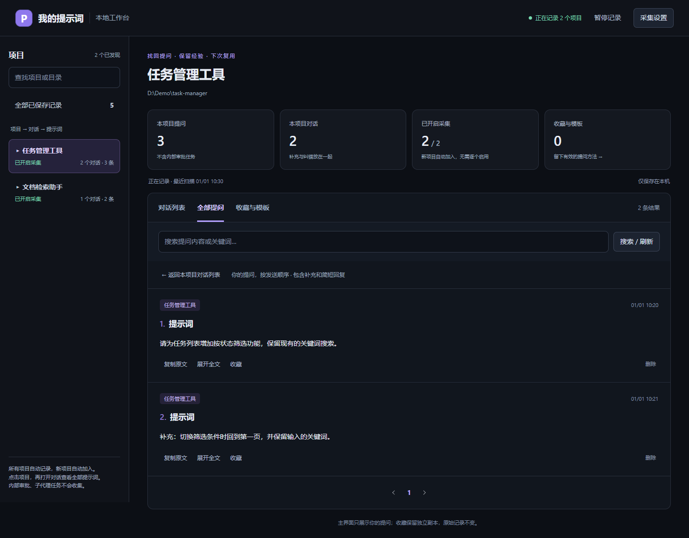
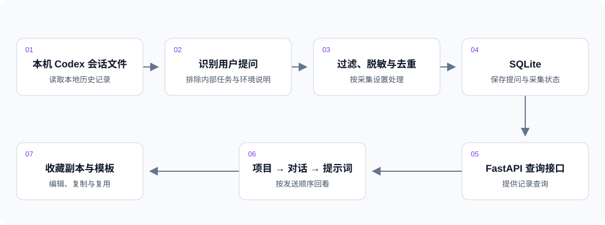

# Codex Prompt History

自动整理本机 Codex 提示词的工具，支持按「项目 → 对话 → 提示词」回看、搜索和复用。

开发时，同一个项目往往有多段对话，需求、补充条件和纠错分散在不同任务中。本项目源于整理这些提问的实际需要：自动保留用户输入，方便后续查找上下文、整理有效提问。

## 界面演示



实际应用界面，使用虚拟项目和模拟提问演示；截图中的数量不代表真实使用规模。左侧选择项目，右侧打开对应对话，按发送顺序查看完整提示词。

## 技术栈

| 部分 | 技术与用途 |
| --- | --- |
| 后端 | Python、FastAPI；读取本机会话，提供查询与收藏接口 |
| 前端 | Vue 3、TypeScript、Element Plus、Vite；项目导航、对话浏览和搜索 |
| 数据库 | SQLite；保存提示词、采集设置和收藏副本 |

不依赖模型 API，也不需要 API Key。模板通过本地文字替换生成，不包含 Agent 编排或模型推理。

## 核心功能

- **自动采集**：默认每 5 秒扫描本机所有项目的用户提问，补录历史，新项目自动加入。
- **分层回看**：按项目和对话分组，按发送顺序展示提示词，保留“继续”“好的”等简短回复。
- **搜索记录**：按项目、提示词关键词查找对话或提问。
- **收藏与复用**：保存独立副本，编辑标签和说明，生成带变量的模板并复制使用。

## 实现流程



[流程图 Mermaid 源码](docs/architecture-flow.mmd)

后端按 API、Service、Repository 分层：采集服务解析会话并增量入库，Repository 负责数据库读写，前端通过 API 展示记录。读取时排除已识别的内部审批与子代理任务，不执行会话中的文字指令。详见[架构说明](docs/architecture.md)。

## 快速开始（Windows）

需要 Python **3.11+**（包含 Python Launcher）、Node.js **22.12+**，以及可联网下载依赖的环境。安装后重新打开 PowerShell。本机需已有 Codex 会话，才能看到采集结果。

### 1. 获取项目

```powershell
git clone https://github.com/Practice-Pcitc/Codex-Prompt-History.git
cd Codex-Prompt-History
```

没有 Git 时，在仓库页面选择 **Code → Download ZIP**。解压后进入包含 README.md、backend、frontend、scripts 的目录，在资源管理器地址栏输入 `powershell` 并回车。下面的命令均在此目录执行。

### 2. 安装依赖

```powershell
Set-ExecutionPolicy -Scope Process Bypass
.\scripts\setup.ps1
```

### 3. 启动并访问

在仓库目录打开两个 PowerShell 窗口，分别运行：

窗口一（后端）：

```powershell
Set-ExecutionPolicy -Scope Process Bypass
.\scripts\start-backend.ps1
```

窗口二（前端）：

```powershell
Set-ExecutionPolicy -Scope Process Bypass
.\scripts\start-frontend.ps1
```

打开 [提示词工作台](http://localhost:5174/prompt-history)，点击左侧项目，再点击 **打开对话**。

首次运行自动补录历史，无需修改源码、填写 API Key 或逐个开启项目。保持后端运行即可持续采集，不需要打开本工具的项目文件夹。下次直接执行启动命令；按 `Ctrl+C` 停止服务。

**默认采集所有本机项目。** 可在“采集设置”中排除目录或切换为指定项目。数据保存在本机 `data/prompt_history.db`，不会由本工具上传 GitHub。

遇到环境或启动问题，按[安装与排错](docs/setup-and-troubleshooting.md)中的对应步骤处理。

## 参与方式与当前限制

项目由作者提出需求、实际使用并反馈问题，Codex 辅助完成代码实现、调整、调试与验证。

- **采集范围**：读取本机 Codex 会话，记录用户文字提问；不记录 AI 回答、工具输出、图片二进制或附件正文，不同步 ChatGPT 网页和其他电脑的对话。
- **显示名称**：项目名来自本地目录，对话标题取首次提问；与 Codex 自定义的项目名称、任务标题可能不同。
- **运行与兼容**：后端停止期间的消息在重启后补录；主动暂停期间的消息不会补录。本机会话格式变化可能影响解析，出现错误需更新适配器。
- **数据保护**：默认对新记录中的常见密码、Token 等字段脱敏，但不能识别所有敏感内容。删除工具中的记录不等于删除 Codex 原会话。数据库和备份不应提交到公开仓库。
- **部署范围**：当前提供 Windows 本机启动方式，无账号认证，不应直接开放到公网。

## 更多文档

- [安装、配置与排错](docs/setup-and-troubleshooting.md)
- [架构与目录](docs/architecture.md)
- [工作台行为与接口](docs/workbench.md)
- [数据库与迁移](docs/database.md)
- [开发规范](docs/development.md)
- [变更记录](CHANGELOG.md)
